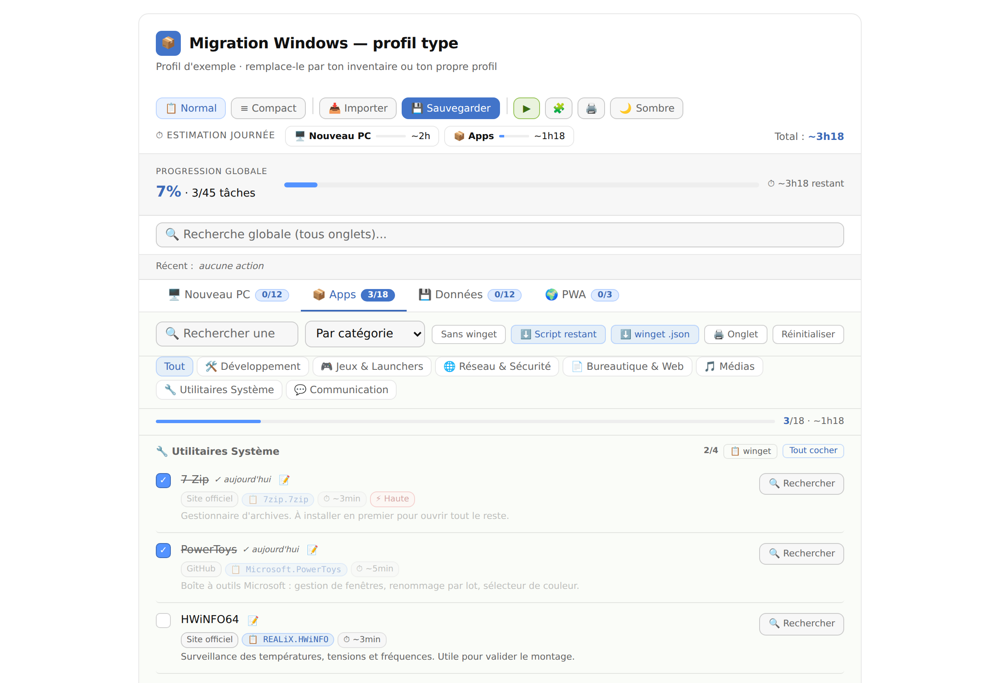
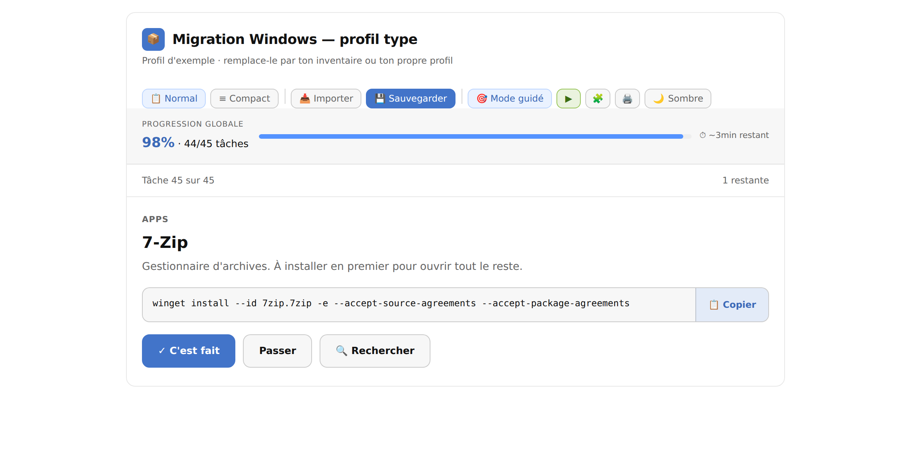

# Migration PC — checklist de réinstallation

Checklist HTML pour réinstaller un PC Windows sans rien oublier : un script inventorie
les logiciels de l'ancienne machine, la page les affiche en liste à cocher.

Fichier unique, aucune dépendance, aucun serveur. Fonctionne depuis une clé USB sur un
PC fraîchement installé, sans réseau.



---

## Sommaire

- [À quoi ça sert](#à-quoi-ça-sert)
- [Démarrage rapide](#démarrage-rapide)
- [Le scanner](#le-scanner)
- [La checklist](#la-checklist)
- [Formats de fichiers](#formats-de-fichiers)
- [Écrire son propre profil](#écrire-son-propre-profil)
- [Vie privée](#vie-privée)
- [Tests](#tests)
- [Déploiement](#déploiement)
- [Limites connues](#limites-connues)

## À quoi ça sert

Réinstaller un PC, c'est trois problèmes : se souvenir de ce qui était installé, le
réinstaller dans le bon ordre, et ne pas oublier de sauvegarder ce qui n'existe qu'en
local. Ce projet couvre les trois.

```
Ancien PC                              Nouveau PC
─────────                              ──────────
scan-pc.ps1 ──► inventaire-pc.json ──► index.html ◄── verifier-pc.ps1
                                           ▲              (constate ce qui
verifier-sauvegardes.ps1 ──────────────────┘               est déjà installé)
  (compare les dossiers copiés)
```

Trois scripts, une page. `scan-pc.ps1` inventorie la machine qu'on quitte,
`verifier-pc.ps1` constate ce qui est déjà en place sur celle qu'on installe, et
`verifier-sauvegardes.ps1` vérifie que les dossiers ont bien été copiés. Tous les trois
partagent leur logique de détection, qui vit une seule fois dans `lib-detection.ps1`.

Le scan n'est pas obligatoire : la page s'ouvre sur un profil d'exemple utilisable tel
quel, et vous pouvez écrire le vôtre.

## Démarrage rapide

**Avec un inventaire de l'ancien PC** — sur l'ancienne machine :

```powershell
powershell -ExecutionPolicy Bypass -File .\scan-pc.ps1
```

Copiez `inventaire-pc.json` et `index.html` sur une clé USB. Sur le nouveau PC, ouvrez
`index.html`, cliquez sur **📥 Importer**, choisissez le JSON.

**Sans scan** : ouvrez `index.html` et cochez. Le profil d'exemple couvre les étapes
communes à toute réinstallation Windows.

## Le scanner

`scan-pc.ps1` interroge quatre sources et fusionne les résultats :

| Source | Ce qu'elle apporte |
|---|---|
| `winget list` | Les identifiants d'installation officiels |
| Registre `Uninstall` | Les logiciels installés classiquement (32 et 64 bits, machine et utilisateur) |
| Paquets APPX | Les applications du Microsoft Store |
| Steam, Epic, GOG, Xbox | Les jeux installés, sur tous les disques |
| Variables d'environnement | Les variables personnalisées de l'utilisateur |

Une entrée vue par plusieurs sources est fusionnée : le nom vient du registre,
l'identifiant winget de winget, la taille sur disque de celle qui la connaît, et rien
n'apparaît deux fois. Chaque application est classée par catégorie selon des mots-clés,
avec une priorité et une durée estimée — tout cela reste modifiable à la main dans le
JSON.

Les variables d'environnement personnalisées sont relevées et remplissent directement
les champs prévus par la checklist, sans recopie manuelle. Une valeur déjà saisie n'est
jamais écrasée. Seules les variables de l'utilisateur sont lues : celles du système sont
recréées par Windows et les installateurs.

Les redistribuables Visual C++, les mises à jour et les composants système sont écartés
par défaut, sinon la liste dépasse largement ce qu'on réinstalle vraiment.

| Option | Effet |
|---|---|
| `-Sortie <chemin>` | Change le fichier produit (défaut : `inventaire-pc.json`) |
| `-ToutInclure` | Désactive le filtrage, garde tout |
| `-SansStore` | Ignore les applications du Microsoft Store |
| `-SansJeux` | Ignore les bibliothèques de jeux (Steam, Epic, GOG, Xbox) |
| `-SansVariables` | Ne relève pas les variables d'environnement |

Le script n'a pas besoin des droits administrateur, mais sans eux les logiciels
installés par d'autres comptes utilisateurs peuvent manquer. Il n'écrit qu'un fichier
local et n'envoie rien sur le réseau.

## Vérifier le nouveau PC

Installer dix applications puis cocher dix cases à la main est du travail inutile. Sur
la machine fraîchement installée :

```powershell
powershell -ExecutionPolicy Bypass -File .\verifier-pc.ps1
```

Le script détecte ce qui est déjà présent, le rapproche des éléments du profil et écrit
`verification-pc.json`. À l'import, la page affiche la liste avec la raison de chaque
correspondance — identifiant winget, ou nom seul — et **rien n'est coché sans votre
validation** : un rapprochement par nom peut confondre deux logiciels voisins, et une
case cochée à tort fait sauter une installation.

Par défaut, seuls les identifiants winget sont retenus : moins de correspondances,
aucune fausse. `-NomsApproximatifs` élargit la recherche aux noms.

## Vérifier les sauvegardes

L'onglet Données liste des chemins et on coche en confiance. Ce script compare les deux
côtés :

```powershell
.\verifier-sauvegardes.ps1 -Destination D:\sauvegarde-migration
```

Pour chaque élément qui désigne un vrai dossier, il compte les fichiers et mesure la
taille à la source et dans la copie, puis classe : conforme, écart de taille, incomplet,
copie absente. Un élément qui ne désigne aucun dossier — « Courriels et espaces
clients » — est rapporté comme non vérifiable plutôt que passé sous silence. Un champ
peut porter plusieurs chemins séparés par une virgule ou par « et » : ils sont traités
un par un.

Le rapport produit est aussi une progression : l'importer coche les éléments vérifiés
conformes. `-ToleranceParCent` règle l'écart de taille toléré, 2 % par défaut.

| Option | Effet |
|---|---|
| `-Destination <chemin>` | Le dossier de sauvegarde à comparer (obligatoire) |
| `-Profil <chemin>` | Le profil à vérifier (par défaut `profil-local.json`, puis l'exemple) |
| `-ToleranceParCent <n>` | Écart de taille toléré avant signalement |

## La checklist

Quatre onglets : **Nouveau PC** (drivers et vérifications), **Apps**, **Données** à
sauvegarder, **PWA** (raccourcis web).

La progression est enregistrée dans le navigateur au fur et à mesure et peut être
exportée en JSON pour passer d'une machine à l'autre.

**Navigation** — mode normal ou compact, thème clair/sombre suivant les préférences
système, recherche sur les quatre onglets à la fois, tri des apps par catégorie,
priorité, durée ou ordre conseillé, filtre sur les apps sans winget. La mise en page
s'adapte aux écrans étroits : cibles tactiles agrandies, textes relevés, champs à 16 px
pour éviter le zoom automatique d'iOS.

**Installation sur l'appareil** — depuis la version en ligne, la page s'installe comme
une application et s'ouvre ensuite sans réseau. Le service worker ne met en cache que le
squelette ; la progression vit dans le stockage local et n'est jamais affectée. Ouverte
en `file://` depuis une clé USB, la page ignore simplement cette partie : elle est déjà
autonome.

**Installation** — le badge winget copie la commande d'installation en un clic, un
bouton par catégorie copie le script de toute la section. Deux exports pour réinstaller :
**⬇️ Script restant** produit un `.ps1` limité aux apps non cochées, et
**⬇️ winget .json** le format officiel de `winget import`, à préférer — il saute ce qui
est déjà installé et reprend proprement après une interruption.

```powershell
winget import -i winget-restant.json --accept-package-agreements --accept-source-agreements
```

**Suivi** — barre de progression globale et par onglet, estimation du temps restant
calculée depuis les durées, chronomètre de session, historique des dernières actions,
notes libres sur chaque élément, champs dédiés aux clés de licence et aux variables
d'environnement.

**Mode guidé** — pour le moment où l'on est debout devant la machine. Une tâche à la
fois, dans l'ordre des dépendances, avec seulement ce qui sert alors : la commande
winget prête à copier et l'avertissement s'il y en a un. Filtres, badges, durées et
recherche disparaissent — ils appartiennent à la préparation. Un bouton fait l'aller et
le retour, la vue liste reste le défaut et la progression est la même des deux côtés.



**Sortie** — export de la progression, du profil, du script winget complet ou partiel,
de la checklist en texte, et impression globale ou par onglet.

**En cas de problème** — chaque onglet est rendu séparément. Si l'un échoue, les autres
s'affichent quand même et un bandeau nomme l'onglet fautif et l'erreur, au lieu de
laisser une page à moitié vide sans explication.

**Revenir en arrière** — réinitialiser une section ou importer un fichier remplace du
travail. Ces actions ne demandent pas de confirmation — on clique « oui » par réflexe —
mais s'annulent après coup depuis un bandeau, qui restaure aussi bien les cases que le
profil remplacé.

### Accessibilité

Tout se fait au clavier : les lignes sont des cases à cocher, atteintes par tabulation
et activées par Entrée ou Espace, et le focus reste sur la ligne après la coche. L'anneau
de focus est visible partout (`:focus-visible`), les lignes portent `role="checkbox"` et
`aria-checked`, les onglets `role="tab"`, et la page a des repères `header` et `main`.

Les contrastes respectent le seuil WCAG de 4,5:1 dans les deux thèmes, mesurés sur le
fond réellement peint. Le bleu de l'interface est décliné en trois rôles : `--acc` pour
les aplats et bordures, `--acc-fort` pour le texte et le focus, `--acc-fond` pour les
fonds bleus portant du texte blanc — `#5493FF` seul n'atteint que 3,00:1 et ne peut pas
porter de texte.

Le réglage système « réduire les animations » est respecté : transitions et animations
sont coupées, confettis compris.

## Formats de fichiers

Le bouton **Importer** accepte six formats et les reconnaît tout seul.

**Vérification de PC** — produite par `verifier-pc.ps1`, reconnue à son champ `type`.
Seul format qui ne s'applique pas directement : la page affiche la liste et attend
confirmation.

**Rapport de sauvegardes** — produit par `verifier-sauvegardes.ps1`. C'est une
progression ordinaire enrichie du détail de la comparaison.

**Export winget** — le fichier produit par `winget export -o apps.json` sur n'importe
quel PC, sans rien installer de ce projet. Il ne contient que des identifiants, donc les
noms affichés sont déduits : `Mozilla.Firefox` devient Firefox, édité par Mozilla. Les
catégories sont attribuées par mots-clés.

**Inventaire** — produit par `scan-pc.ps1`, reconnu à son champ `type`. Plus riche
qu'un export winget : il couvre aussi le Microsoft Store, Steam et les logiciels absents
du dépôt winget.

```json
{
  "type": "inventaire-migration-pc",
  "version": 1,
  "genere": "2026-09-24T10:00:00.000+02:00",
  "machine": { "os": "Windows 11 Pro", "nom": "PC-BUREAU" },
  "apps": [
    { "nom": "7-Zip", "editeur": "Igor Pavlov", "version": "24.08",
      "source": "registre, winget", "winget": "7zip.7zip",
      "cat": "system", "priorite": "med", "duree": 5, "tailleGo": 0.02 }
  ],
  "variables": { "JAVA_HOME": "C:\\Program Files\\Java\\jdk-21" }
}
```

**Profil** — les listes des quatre onglets. C'est le format de `presets/exemple.json`,
et celui que produit le bouton 🧩.

**Progression** — les cases cochées, les notes et les dates, sans les listes. C'est ce
que produit le bouton 💾.

Importer un export winget, un inventaire ou un profil remplace les listes mais conserve
la progression. Importer une progression fait l'inverse.

## Écrire son propre profil

Copiez `presets/exemple.json` et modifiez-le. Les identifiants doivent être uniques
dans tout le fichier : ce sont eux qui portent les cases cochées.

Le profil d'exemple existe en double : dans ce fichier, et embarqué dans `index.html`
pour que la page fonctionne sans serveur. Après avoir modifié le fichier, lancez
`npm run sync` pour recopier l'un dans l'autre — `npm test` échoue s'ils divergent.

```javascript
meta   // { nom, soustitre } — affichés dans l'en-tête
cats   // { clé: libellé } — les catégories de l'onglet Apps
npc    // { id, o, n, src, p, t, d, post?, dep?, warn? }
apps   // { id, n, c, src, w?, p, t, d, dep?, warn? }
data   // { id, n, p, note, pr, lic?, env? }
pwa    // { id, n, u, d }
ordre  // [ id, ... ] — l'ordre d'installation conseillé
requetes // { "Nom de l'app": "requête de recherche" }
```

`p` et `pr` valent `high`, `med` ou `ok` · `t` est une durée en minutes · `o` est le
numéro d'étape · `post: true` classe l'étape dans les vérifications d'après-installation
· `w` est l'identifiant winget · `warn` affiche un avertissement.

`dep` accepte deux formes. Une **chaîne** est un libellé affiché tel quel, sans
vérification possible — c'est le format d'origine, toujours accepté. Un **tableau
d'identifiants** décrit un vrai lien et débloque trois choses : le badge nomme les
prérequis et se met en évidence tant qu'ils ne sont pas cochés, un avertissement
apparaît si vous cochez dans le désordre — sans jamais bloquer —, et l'ordre
d'installation est calculé par tri topologique au lieu d'être maintenu à la main dans
`ordre`. Les scripts winget, `.ps1` comme `.json`, sortent dans cet ordre. Les cycles
sont rompus plutôt que de figer la page.

```json
{ "id": "a10", "n": "Visual Studio Code", "dep": ["a7"] }
```

Les liens de téléchargement sont volontairement des requêtes de recherche restreintes
au domaine officiel (`site:7-zip.org download`) plutôt que des URL directes : une URL
de téléchargement est périmée en quelques mois, une requête reste valable et évite les
faux sites de drivers.

## Vie privée

Tout reste sur votre machine. La page est un fichier statique sans serveur ni appel
réseau : la progression et le profil importé vivent dans le stockage local du
navigateur, les exports sont des téléchargements ordinaires.

L'inventaire produit par le scan décrit précisément votre machine. Ne le publiez pas,
et faites attention à ce que vous écrivez dans les notes et les champs de licence — ils
partent dans le fichier de progression exporté.

Le stockage local est lié au navigateur **et** au chemin du fichier. Si la lettre de
lecteur de la clé USB change d'un PC à l'autre, la progression ne suit pas : l'export
JSON est le seul transfert fiable.

## Tests

```bash
npm install                       # une seule fois
npm test                          # profil, checklist et formats winget
npm run test:scan                 # scanner (nécessite PowerShell)
npm run test:navigateur           # rendu réel dans Chromium
npm run test:pwa                  # installabilité et fonctionnement hors ligne
npm run test:mobile               # ergonomie tactile
npm run test:a11y                 # accessibilité et réversibilité
npm run test:guide                # mode guidé
```

Quatorze suites, dans l'ordre où la CI les lance.

`tests/test-profil-sync.js` garantit que le profil embarqué dans `index.html` et
`presets/exemple.json` ne divergent pas, et vérifie les invariants du profil :
identifiants uniques sur les quatre onglets, priorités valides, catégories déclarées,
ordre conseillé ne citant que des éléments existants. Il contrôle aussi que les fichiers
dont les tests dépendent sont bien versionnés, et qu'aucune fonction n'est définie deux
fois dans `index.html` — une redéfinition écrase silencieusement la première et ce piège
a coûté trois bugs au projet.

`tests/test-checklist.js` extrait le JS de `index.html` et l'exécute dans un DOM simulé.
Il rejoue l'import d'un inventaire réellement produit par le scanner
(`tests/inventaire-exemple.json`), ce qui couvre la chaîne de bout en bout.

`tests/test-scan.ps1` et `tests/test-verification.ps1` couvrent le classement, la fusion
entre sources, le parsing de la sortie winget et le rapprochement avec le profil, sans
toucher à la machine.

`tests/test-sauvegardes.ps1` **exécute réellement** `verifier-sauvegardes.ps1` sur une
arborescence construite pour l'occasion — copie fidèle, copie tronquée, copie vide,
source absente, chemins multiples — et constate son verdict. C'est le seul script
PowerShell du projet qui tourne hors Windows, puisqu'il ne lit que des fichiers.

`tests/test-navigateur.js` charge la page dans un vrai Chromium et vérifie ce qu'un DOM
simulé ne voit pas : que les quatre panneaux sont bien frères et non imbriqués, que les
éléments ont une taille non nulle, que la saisie des clés de licence survit à un
rechargement, et qu'une exception pendant un rendu s'affiche au lieu de disparaître.
Deux variables d'environnement facultatives : `CHROME` pour pointer un binaire Chromium
existant, `PROFIL` pour tester votre propre profil à la place de l'exemple (par défaut
il cherche `profil-local.json` à la racine).

`tests/test-pwa.js` sert le dépôt en HTTP local — un service worker ne s'enregistre pas
en `file://` — et vérifie que la page s'installe, se met en cache et s'ouvre réseau
coupé, tout en restant fonctionnelle en `file://`.

`tests/test-mobile.js` ouvre la page à la largeur de deux téléphones, dans les deux
thèmes, et mesure les cibles tactiles, les écarts entre elles, les tailles de texte et
les débordements horizontaux. Par défaut il rapporte ; `STRICT=1` le fait échouer, ce
que la CI utilise.

`tests/test-accessibilite.js` calcule le contraste de chaque texte sur le fond
réellement peint dans les deux thèmes, parcourt la page au clavier jusqu'à cocher une
tâche, vérifie les rôles et états annoncés, l'annulation des actions destructrices et le
respect du mouvement réduit.

`tests/test-guide.js` couvre le mode guidé : ce qui doit rester visible, ce qui doit
disparaître, le parcours d'une tâche à l'autre, la copie de la commande dans le
presse-papier, et le fait que ce mode tient les mêmes exigences de contraste, de cible
tactile et de clavier que la vue liste.

### Intégration continue

`.github/workflows/ci.yml` lance les quatorze suites à chaque push et sur chaque pull
request. La publication sur GitHub Pages dépend de ce job : un test rouge, et rien n'est
mis en ligne.

Pour que ce garde-fou serve, le dépôt doit être réglé sur **Settings → Pages → Source :
GitHub Actions**. Sur « Deploy from a branch », GitHub publierait la branche en parallèle
et court-circuiterait les tests.

## Déploiement

```
Migration-PC/
├── index.html                    # la checklist (tout est dedans)
├── lib-detection.ps1             # détection partagée par les trois scripts
├── scan-pc.ps1                   # inventorie l'ancien PC
├── verifier-pc.ps1               # constate ce qui est déjà sur le nouveau
├── verifier-sauvegardes.ps1      # compare les dossiers copiés
├── manifest.json, sw.js, icons/  # installation et fonctionnement hors ligne
├── presets/exemple.json          # profil d'exemple, aussi embarqué dans index.html
├── tests/                        # suites Node, PowerShell et navigateur
└── .github/workflows/ci.yml      # tests, puis publication si tout est vert
```

Les trois scripts PowerShell ont besoin de `lib-detection.ps1` à côté d'eux : copiez le
dossier, pas un fichier isolé.

`package.json` ne sert qu'aux tests : `index.html` n'a aucune dépendance et n'a jamais
besoin d'être construit.

Les fichiers personnels (`profil-*.json`, `inventaire-*.json`, `progression-*.json`)
sont exclus par `.gitignore` : gardez le vôtre en local, hors du dépôt.

Le dépôt est publiable tel quel sur GitHub Pages : **Settings → Pages → Deploy from a
branch → `main` → `/ (root)`**.

```bash
git clone https://github.com/antoniman31/Migration-PC.git
```

URL publiée : `https://antoniman31.github.io/Migration-PC`

## Limites connues

Le scanner est **Windows uniquement** et demande PowerShell 5.1 ou supérieur. S'il
refuse de démarrer, lancez-le avec `-ExecutionPolicy Bypass`.

**Tous les logiciels n'ont pas d'identifiant winget.** Ceux détectés par le registre
seul sortent sans commande d'installation : la checklist les affiche avec un lien de
recherche à la place. Le filtre « Sans winget » permet de les isoler, et ils
n'apparaissent pas dans l'export `winget .json`, qui ne peut contenir que des paquets
connus de winget.

**Un export winget importé perd les noms d'origine.** Le format ne stocke que les
identifiants ; `7zip.7zip` donne « 7zip » et non « 7-Zip ». Passer par `scan-pc.ps1`
donne des noms corrects, puisqu'il lit le registre.

**La déduplication est approximative.** Elle compare les noms en ignorant la version et
les mentions entre parenthèses, ce qui rapproche correctement `Mozilla Firefox (x64 fr)`
du registre et `Mozilla Firefox` de winget, mais fusionne aussi deux versions majeures
d'un même logiciel — Python 3.12 et 3.13 donnent une seule ligne.

**Le classement par catégorie est indicatif**, fondé sur des mots-clés. Un logiciel peu
connu atterrit dans « Utilitaires Système ». Les catégories se corrigent dans le JSON.

**Les étapes « Nouveau PC », « Données » et « PWA » ne sont pas scannées** : un
inventaire importé reprend celles du profil d'exemple, à adapter à votre matériel. Un
scan ne peut pas deviner qu'il faut activer le profil XMP dans le BIOS. Les variables
d'environnement font exception : elles sont relevées et reportées automatiquement.

**Les tailles sur disque sont partielles.** Steam et Epic les donnent exactement, le
registre les estime — et se trompe parfois largement —, le Microsoft Store, GOG et Xbox
ne les donnent pas du tout. Le total affiché est donc un minimum, utile pour dimensionner
un disque, pas un inventaire comptable.

**L'installation sur l'appareil demande HTTPS.** Un service worker ne s'enregistre pas
depuis un fichier ouvert directement : depuis une clé USB, la page fonctionne mais ne
s'installe pas et n'a pas de cache. Elle n'en a pas besoin, tout est dans le fichier.
