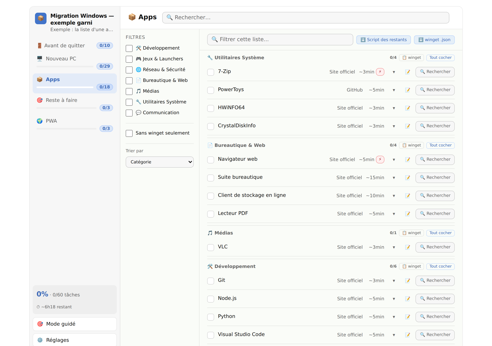
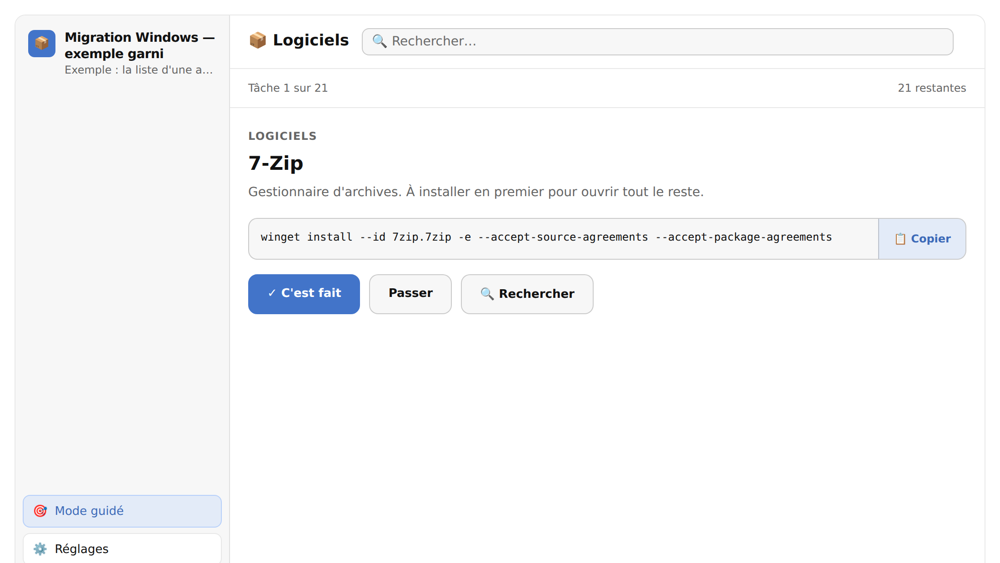
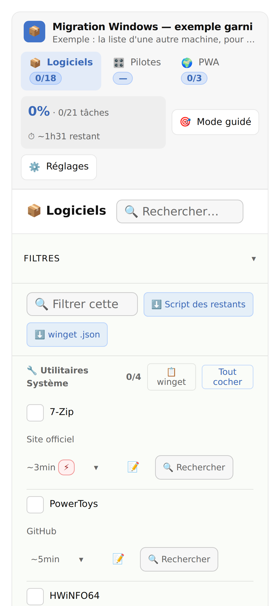

# Migration PC — checklist de réinstallation

Checklist HTML pour réinstaller un PC Windows sans rien oublier. Des scripts PowerShell
relèvent les logiciels installés sur l'ancienne machine et les pilotes de la nouvelle ;
la page compare les deux et dit ce qui manque.

**Ce qu'il fait, et rien d'autre** : lister les logiciels du PC source, lister ceux du PC
cible, dire la différence — et signaler les périphériques sans pilote sur la cible, avec
le lien du constructeur. Il ne sauvegarde **rien**. Vos fichiers personnels restent
entièrement à votre charge.

`index.html` se suffit à lui-même : aucune dépendance, aucun serveur, aucune étape de
construction. Il s'ouvre depuis une clé USB sur un PC fraîchement installé, sans réseau.
Les scripts sont facultatifs.

## Aperçu

L'onglet **Apps** : la liste des logiciels relevés sur l'ancien PC, regroupés par
catégorie, avec leur version, leur poids et la commande qui les réinstalle.

<picture>
  <source media="(prefers-color-scheme: dark)" srcset="captures/checklist-sombre.png">
  
</picture>

Le **mode guidé**, pour le jour de l'installation : une tâche à l'écran, « c'est fait »
ou « passer », et rien d'autre.

<picture>
  <source media="(prefers-color-scheme: dark)" srcset="captures/mode-guide-sombre.png">
  
</picture>

Et sur **téléphone**, parce que la page sert aussi à cocher d'une main pendant que
l'autre branche un câble.

<picture>
  <source media="(prefers-color-scheme: dark)" srcset="captures/mobile-sombre.png">
  
</picture>

## En trois lignes

1. Clé USB branchée sur le **PC que vous quittez** : double-cliquez
   `Migration PC.bat`, choisissez **SOURCE**. La page s'ouvre déjà remplie de
   vos logiciels.
2. Débranchez la clé, branchez-la sur le **PC cible** — le neuf, ou le même une
   fois réinstallé.
3. Double-cliquez `Migration PC.bat`, choisissez **CIBLE**. La page s'ouvre sur
   ce qu'il reste à installer.

Rien à importer à la main entre les deux. L'instantané de la source voyage sur
la clé : le scan de la source en dépose une copie à côté de `index.html`, et
celui de la cible la relit et la joint au résultat. C'est nécessaire parce que
la mémoire du navigateur ne traverse pas d'une machine à l'autre — sans ce
relais, le PC neuf recevrait un scan de lui-même et rien à quoi le comparer.

Un seul fichier à lancer : `Migration PC.bat`. Tout le reste est rangé dans
`scripts/` — c'est là pour être lu, pas pour être lancé à la main.

> Windows affiche un avertissement SmartScreen sur un `.bat` téléchargé depuis
> Internet : « Informations complémentaires » puis « Exécuter quand même ».
> Aucune astuce ne l'évite sans certificat de signature payant. Les fichiers sont
> lisibles dans le Bloc-notes — ouvrez-les avant de les lancer si vous voulez
> vérifier ce qu'ils font.

---

## Sommaire

- [À quoi ça sert](#à-quoi-ça-sert)
- [Le parcours en deux double-clics](#le-parcours-en-deux-double-clics)
- [Démarrage rapide](#démarrage-rapide)
- **Les scripts Windows**
  - [Inventorier le PC source](#inventorier-le-pc-source)
  - [Vérifier le PC cible](#vérifier-le-pc-cible)
- [Quatre cas, deux questions](#quatre-cas-deux-questions)
  - [Installer Windows sans rester devant](#installer-windows-sans-rester-devant)
- [La checklist](#la-checklist)
  - [La barre du haut](#la-barre-du-haut)
  - [Ma configuration](#ma-configuration)
  - [Repartir de zéro](#repartir-de-zéro)
  - [Mode guidé](#mode-guidé)
  - [Accessibilité](#accessibilité)
- [Formats de fichiers](#formats-de-fichiers)
- [Écrire son propre profil](#écrire-son-propre-profil)
- [Licence](#licence)
- [Vie privée](#vie-privée)
  - [Un profil reçu est une entrée non fiable](#un-profil-reçu-est-une-entrée-non-fiable)
- [Tests](#tests)
  - [Intégration continue](#intégration-continue)
- [Déploiement](#déploiement)
- [Limites connues](#limites-connues)

## À quoi ça sert

Réinstaller un PC, c'est se souvenir de ce qui était installé et le remettre. Ce projet
couvre ça, dans **deux situations** : passer sur une autre machine, ou repartir propre
sur celle qu'on a déjà. Ce qu'il ne couvre pas — la sauvegarde de vos fichiers — il le
dit au lieu de le laisser croire.

```
PC SOURCE                                        PC CIBLE
(celui qu'on quitte)                (le neuf, ou le même réinstallé)
────────────────────                ───────────────────────────────
scan-pc.ps1 -Role source                  scan-pc.ps1 -Role cible
        │                                           │
        └──► instantane-source-AAAA-MM-JJ.json ──┐  └──► instantane-cible-….json
                                                 │              │
                                                 └──► index.html ◄┘
                                                    compare les deux
```

**Le même script des deux côtés.** Sur la source il fige l'état de la machine ; sur la
cible il refait le même relevé, et c'est la page qui compare les deux. Ça a une
conséquence qui simplifie tout : « PC neuf » et « même PC après réinstallation »
deviennent exactement le même cas.

Les deux côtés partagent leur logique de détection, qui vit une seule fois dans
`lib-detection.ps1`.

Chaque instantané porte sa date et n'écrase jamais le précédent : « l'état d'une machine
à un instant donné » n'existe pas si un second scan efface le premier. Un raccourci
`inventaire-pc.json` pointe toujours vers le dernier.

Le scan n'est pas obligatoire : la page s'ouvre sur un profil d'exemple utilisable tel
quel, et vous pouvez écrire le vôtre.

## Le parcours en deux double-clics

Posez le dossier entier sur une clé USB et double-cliquez **`Migration PC.bat`**. Un menu
demande sur quelle machine vous êtes — la seule question à laquelle personne ne peut
répondre à votre place — et lance le bon script. Il n'ajoute aucune capacité : il appelle
les mêmes scripts, qu'on peut toujours lancer à la main. Une action dont il manque un
fichier reste affichée, grisée, avec la raison : plus utile qu'une action absente dont on
ignore pourquoi.

Après chaque action, il dit quoi faire ensuite sur le site — quel onglet, quel bouton.
Et une entrée **Par où commencer ?** décrit le parcours complet des trois situations :
changer de PC, réinstaller sur place, garder les deux machines.

Il y a eu une fenêtre graphique ici. Elle a été retirée : elle était le seul morceau du
projet qu'aucun test ne pouvait exercer — `System.Windows.Forms` ne se pilote pas sur une
machine d'intégration sans écran — alors que le menu texte, lui, est lancé et vérifié à
chaque publication. Moins de code, et plus rien qui échappe aux tests.

Il y a eu deux raccourcis numérotés à côté du menu, `1-scanner-ce-pc.bat` et
`2-verifier-ce-pc.bat`. Ils sont partis : trois fichiers `.bat` qui se ressemblent,
dans un dossier qui en comptait vingt et un, désorientaient plus qu'ils n'aidaient.
Le menu fait les deux, et il dit lequel choisir.

Sur le PC source, l'option « Ce PC est la SOURCE » fige l'état de la machine, écrit
l'instantané à côté de la page et l'ouvre. La checklist s'affiche **déjà remplie de vos
logiciels** — rien à importer. Vous ajustez, et l'onglet **Reste à faire** dit ce qu'il
reste à sortir avant d'effacer.

Sur le PC cible, l'option « Ce PC est la CIBLE » relance **le même relevé**, et la page
compare les deux instantanés : ce qui est arrivé, ce qui manque, ce qui est là dans une
version plus ancienne qu'avant. La clé a fait le transport.

Le vocabulaire compte : « nouveau PC » décrit mal le cas le plus courant, qui est de
réinstaller la machine qu'on a déjà. Source et cible peuvent être le même ordinateur, à
deux moments différents.

Le `.bat` existe pour une seule raison : Windows refuse d'exécuter un `.ps1` par
double-clic. Il appelle le script en contournant ce blocage pour ce seul lancement, et
reste lisible dans le Bloc-notes — contrairement à un `.exe`, qu'il faudrait croire sur
parole pour un outil qui lit tout votre PC.

**Le relais entre les deux machines.** La procédure tient en trois gestes : on
scanne la source, on débranche la clé, on scanne la cible. Entre les deux il y a
un changement de machine, donc un changement de navigateur — et la mémoire
locale de la page, où vit l'instantané de la source, ne traverse pas. Sur le PC
neuf, la page recevait donc un scan de cible et rien à quoi le comparer.

Le relais, c'est la clé elle-même. Le scan de la source dépose une copie de son
instantané à côté de `index.html`, sous le nom fixe `instantane-source.json` ;
celui de la cible la relit et la joint au résultat. Les deux voyagent alors
ensemble, et personne n'a de fichier à retrouver. Si la clé ne porte pas la
page, le scan de la source le dit au lieu de laisser découvrir le problème sur
l'autre machine.

**Comment la page se remplit toute seule.** Ouverte depuis une clé, elle n'a pas le droit
d'aller lire un fichier : le navigateur refuse. Mais elle peut charger un fichier
JavaScript posé à côté d'elle. Les scripts écrivent donc `resultat-scan.js` en plus du
`.json`, et ouvrir `index.html` suffit. Sans ce fichier, la page s'ouvre normalement.

Ce fichier étant chargé, il est exécuté : sur votre propre clé c'est sans objet, sur une
clé prêtée c'est du code qui tourne. Ce qu'il dépose est traité comme n'importe quel
import — des données, jamais des instructions — et la page annonce d'où ça vient au lieu
d'apparaître pleine sans explication. **⋯ Plus → Les scripts pour Windows** propose les
fichiers au téléchargement, et `-PasDOuverture` empêche les scripts d'ouvrir le
navigateur.

## Démarrage rapide

**Le plus court** : ouvrez `index.html` et cochez. Le profil d'exemple couvre les étapes
communes à toute réinstallation Windows, aucun script n'est nécessaire.

**Le parcours complet.** Téléchargez `migration-pc.zip` depuis la page — un seul bouton,
une seule archive, qui contient exactement ce qui se lance et rien d'autre. Décompressez-la
sur une clé USB, puis double-cliquez `Migration PC.bat` : le menu demande sur quelle
machine vous êtes et lance ce qu'il faut.

Pour qui préfère la ligne de commande, dans l'ordre :

1. Sur le **PC source** — celui que vous quittez — figez son état.

   ```powershell
   powershell -ExecutionPolicy Bypass -File .\scripts\scan-pc.ps1 -Role source
   ```

2. Sauvegardez vos fichiers personnels. **Le scan liste, il ne copie rien** : cette
   étape-là n'est pas outillée par ce projet, elle est entièrement à vous.

3. Copiez la clé : la page, les scripts et l'instantané.

4. Sur le **PC cible**, ouvrez `index.html` et importez l'instantané de la source.
   Passez en **🎯 Mode guidé** et suivez les tâches une par une.

5. Sur le PC cible, relancez le même script de l'autre côté :

   ```powershell
   powershell -ExecutionPolicy Bypass -File .\scripts\scan-pc.ps1 -Role cible
   ```

   L'onglet **🎯 Reste à faire** compare les deux instantanés et dit ce qui est
   arrivé, ce qui manque, et ce qui est là dans une version plus ancienne qu'avant.

## Inventorier le PC source

`scan-pc.ps1` interroge plusieurs sources et fusionne les résultats :

| Source | Ce qu'elle apporte |
|---|---|
| `winget list` | Les identifiants d'installation officiels |
| Registre `Uninstall` | Les logiciels installés classiquement (32 et 64 bits, machine et utilisateur) |
| Paquets APPX | Les applications du Microsoft Store |
| Steam, Epic, GOG, Xbox, Ubisoft, EA | Les jeux installés, sur tous les disques |
| WMI et registre | La machine elle-même : fabricant, modèle, n° de série, portable ou fixe, écrans branchés |
| `Win32_PnPSignedDriver` | Les pilotes qui ne viennent pas de Microsoft, groupés par classe |

Une entrée vue par plusieurs sources est fusionnée : le nom vient du registre,
l'identifiant winget de winget, la taille sur disque de celle qui la connaît, et rien
n'apparaît deux fois. Chaque application est classée par catégorie selon des mots-clés,
avec une priorité et une durée estimée — tout cela reste modifiable à la main dans le
JSON.

**Ce que le scan ne relève pas, et pourquoi.** Il a relevé jusqu'à trente-deux familles :
réglages, favoris, Wi-Fi, polices, tâches planifiées, VPN, machines virtuelles, gros
dossiers. Tout ça marchait, et tout ça a été retiré. La raison tient en une phrase : le
programme **listait sans jamais copier**. Une liste de ce qu'on va perdre n'est pas une
sauvegarde, et la présenter à côté d'une vraie liste de logiciels installables laissait
croire le contraire au pire moment — juste avant un formatage. `COUVERTURE.md` garde le
détail de ce qui est parti.

| Option | Effet |
|---|---|
| `-Role source\|cible` | De quel côté on est. `source` par défaut |
| `-Sortie <chemin>` | Change le fichier produit (défaut : `instantane-<role>-<date>.json`) |
| `-SansStore` | Ignore les applications du Microsoft Store |
| `-SansJeux` | Ignore les bibliothèques de jeux |
| `-ToutInclure` | Garde aussi les redistribuables et les composants système |
| `-PasDOuverture` | N'ouvre pas le navigateur à la fin |

## Vérifier le PC cible

Installer dix applications puis cocher dix cases à la main est du travail inutile. Sur
la machine fraîchement installée, on relance **le même script** :

```powershell
powershell -ExecutionPolicy Bypass -File .\scripts\scan-pc.ps1 -Role cible
```

Il produit un instantané de même forme que celui de la source, et la page les compare.
Le rapprochement se fait sur le nom normalisé du logiciel, avec les mêmes règles des deux
côtés : sans ça, « Mozilla Firefox (x64 fr) » sur la source et « Mozilla Firefox » sur la
cible seraient comptés comme deux logiciels différents.

Sur la cible, le script relève en plus ce qui n'a de sens que là : les périphériques que
Windows signale comme sans pilote ou en erreur. La page affiche la liste et fabrique le
lien vers la page de support du constructeur à partir du modèle de la machine.

Ce que le volet pilotes **ne dit jamais**, c'est qu'une version plus récente existe. Le
programme ne fait aucun appel réseau : il ne peut pas le savoir, et l'affirmer serait
mentir. Il signale ce qui manque ou ce qui est en erreur, et donne l'adresse où aller
comparer.

Rien n'est coché sans votre validation : un rapprochement par nom peut confondre deux
logiciels voisins, et une case cochée à tort fait sauter une installation.

## Quatre cas, deux questions

À la première ouverture, la page pose deux questions : ce que vous installez, et ce que
devient l'ancienne machine. Elle règle le cas toute seule et se referme. C'est un
bandeau, pas une porte : la checklist reste lisible derrière, « Passer » l'écarte, et
**⋯ Plus → Adapter à mon cas** le rappelle plus tard. Une page déjà entamée n'est jamais
interrogée.

Quatre cas, un sélecteur en haut de page pour en changer à tout moment. Les deux premiers partagent l'essentiel —
pilotes, applications, sauvegardes — et un élément sans mention vaut pour les deux, ce
qui est la majorité.

Ce qui change en **migration** : le montage est neuf, donc on vérifie le sens des
ventilateurs, et on peut effacer le disque de l'ancienne machine puisqu'on s'en sépare.

Ce qui change en **réinstallation** : le BIOS est déjà réglé, donc ses étapes se lisent
« vérifier que » au lieu d'« activer » — un réglage saute parfois après une mise à jour
du BIOS. Surtout, deux étapes apparaissent, qui n'ont de sens que là. D'abord
**télécharger les pilotes sur une clé USB avant de formater** : si Windows ne reconnaît
pas la carte réseau au premier démarrage, il n'y a pas d'autre machine sous la main pour
aller les chercher. Ensuite un **point de non-retour**, juste avant de lancer
l'installation, qui récapitule ce qui doit être fait *et vérifié* — parce qu'une fois le
disque effacé, cette machine n'est plus une source.

Le filtre vaut partout, pas seulement dans les listes : les compteurs, les boutons
« Tout cocher », la recherche, le mode guidé, la réinitialisation d'une section et
l'export texte s'y tiennent. Cocher en masse n'atteint jamais un élément qu'on n'a pas
sous les yeux, et un intitulé alternatif s'affiche sur les cinq onglets, pas seulement
dans « Nouveau PC ».

**Deux PC** est le cas qu'on oublie : le nouveau PC arrive, mais l'ancien reste en
service — un fixe et un portable. La checklist ne savait que transférer, donc elle
faisait désautoriser Steam, délier les licences et fermer les sessions d'une machine
qu'on rallume le lendemain. Dans ce cas ces quatre étapes disparaissent, trois se
retournent — on ne délie plus ses licences Adobe, on compte combien de postes elles
autorisent — et cinq apparaissent, qui n'existaient nulle part : répartir les dossiers
entre les deux machines avant de synchroniser quoi que ce soit, mettre la
synchronisation en place, vérifier qu'elle marche **dans les deux sens**, se donner une
règle contre les versions divergentes, et harmoniser les réglages. L'onglet lui-même
change de nom : « Sur l'ancien PC » plutôt que « Avant de quitter ».

**Juste mes affaires** fonctionne à l'envers des deux autres. Eux partent de tout et
retirent le peu qui ne les concerne pas ; celui-ci part de rien et ne garde que ce qu'on
lui nomme : les onglets Apps et PWA en entier, plus les étapes marquées
`pilote` dans le profil. Ni BIOS, ni installation de Windows, ni vérifications
matérielles. C'est la vue des soirs où l'on réinstalle ses logiciels et rapatrie ses
dossiers sur une machine déjà en route. Sans cette inversion, les réglages BIOS — qui ne
portent aucune mention, justement parce qu'ils valent pour les deux premiers cas — s'y
retrouveraient aussi.

Un onglet que le cas choisi vide entièrement ne reste pas muet : il dit dans quel cas on
est, et combien d'éléments il compte dans les autres.

Le choix est mémorisé, et une case cochée dans un mode reste cochée dans l'autre : le
filtre change ce que vous regardez, pas ce que vous avez fait. Le total affiché suit le
mode, donc il bouge quand vous basculez.

### Installer Windows sans rester devant

L'étape « Préparer la clé d'installation Windows » renvoie vers le générateur de
[Christoph Schneegans](https://schneegans.de/windows/unattend-generator/). On y coche ce
qu'on veut — langue, fuseau, partitionnement, compte local plutôt qu'un compte
Microsoft, réglages de confidentialité, applications préinstallées à retirer — et il
produit un `autounattend.xml`. Déposé à la racine de la clé, ce fichier répond à votre
place aux questions de l'installation.

Le projet ne génère pas ce fichier lui-même : il contient des réponses propres à une
machine et parfois un mot de passe, il n'a rien à faire dans un dépôt public, et le
générateur en amont est maintenu et couvre bien plus de cas que ce qu'on écrirait ici.
C'est une suggestion, pas une étape obligatoire — une installation cliquée à la main
marche tout aussi bien, elle demande juste d'être présent.

## La checklist

Cinq onglets : **Avant de quitter** le PC source, **Nouveau PC**, **Apps**, **Reste à
faire** (la comparaison entre les deux machines) et **PWA** (raccourcis web).

Le premier onglet regroupe ce qui se fait sur la machine qu'on abandonne et qui ne se
rattrape pas ensuite : désactiver les licences Adobe et les autres activations liées au
matériel — désinstaller ou formater ne désactive rien —, transférer l'application
d'authentification et sortir les codes de récupération, noter la clé BitLocker, vérifier
que les sauvegardes sont restaurables, désautoriser Steam et iTunes, et effacer le
disque en sécurité si la machine est cédée. Les trois groupes sont classés par ce qu'on
risque : irréversible, pénible à rattraper, confort.

L'onglet Nouveau PC suit l'ordre réel d'une installation, et commence avant Windows :
les réglages du BIOS — TPM 2.0 et Secure Boot, qui conditionnent l'installation de
Windows 11, désactivation du CSM, profil XMP/EXPO, Resizable BAR, virtualisation — puis
l'installation elle-même, le système, les pilotes, et enfin les vérifications
matérielles. Chaque étape dit pourquoi elle existe et ce qu'on risque à l'oublier.

La progression est enregistrée dans le navigateur au fur et à mesure et peut être
exportée en JSON pour passer d'une machine à l'autre.

**Navigation** — mode normal ou compact, thème clair/sombre suivant les préférences
système, recherche sur les cinq onglets à la fois, tri des apps par catégorie,
priorité, durée ou ordre conseillé, filtre sur les apps sans winget. La mise en page
s'adapte aux écrans étroits : cibles tactiles agrandies, textes relevés, champs à 16 px
pour éviter le zoom automatique d'iOS.

**S'installer comme une application** — depuis la version en ligne, la page s'installe
et s'ouvre ensuite sans réseau. Le service worker ne met en cache que le
squelette ; la progression vit dans le stockage local et n'est jamais affectée. Ouverte
en `file://` depuis une clé USB, la page ignore simplement cette partie : elle est déjà
autonome.

**Réinstaller** — le badge winget copie la commande d'installation en un clic, un
bouton par catégorie copie le script de toute la section. Deux exports pour réinstaller :
**⬇️ Script restant** produit un `.ps1` limité aux apps non cochées, et
**⬇️ winget .json** le format officiel de `winget import`, à préférer — il saute ce qui
est déjà installé et reprend proprement après une interruption.

```powershell
winget import -i winget-restant.json --accept-package-agreements --accept-source-agreements
```

**Suivi** — barre de progression globale et par onglet, estimation du temps restant
calculée depuis les durées, chronomètre de session, historique des dernières actions,
notes libres sur chaque élément, champs dédiés aux clés de licence et aux variables
d'environnement.

**Sortie** — export de la progression, du profil, de la checklist en texte, du script
winget restant ou du fichier `winget import`, et impression globale ou par onglet. Tout
ce qui sort suit le scénario choisi et ses intitulés : un fichier qui dirait autre chose
que l'écran serait pire que pas de fichier.

### Ma configuration

Les scripts relèvent le matériel et remplissent ces champs tout seuls : Windows connaît
la machine, il n'y a pas de raison de recopier une étiquette de carton. Une valeur déjà
saisie n'est jamais écrasée — elle est peut-être plus précise que ce que Windows
rapporte, et c'est la personne qui a raison.

Une seule exception, et elle a une raison : le scan lancé avec `-Role cible` tourne
sur le PC qu'on équipe, donc elle seule sait de quelle machine elle parle, et elle seule
corrige une valeur. Un inventaire vient presque toujours de l'**ancien** PC — c'est tout
l'intérêt du scan — et un profil décrit peut-être une troisième machine : ceux-là ne
comblent que les cases vides. Sinon, sur le PC neuf, les intitulés des pilotes
porteraient le modèle de la carte mère qu'on vient d'abandonner.

La configuration voyage avec le profil exporté, dans un champ `materiel`. Sans cela tout
le bénéfice disparaissait au moment du transfert, c'est-à-dire exactement là où il sert.

**⋯ Plus → Ma configuration** ouvre les mêmes cinq champs à remplir à la main : carte
mère, processeur, carte graphique, mémoire, SSD. Ce qu'on y écrit fait deux choses. Les intitulés des pilotes
portent le modèle — « Pilote chipset — ASUS B850-A » — là où ils disaient « de la carte
mère », et seulement ceux-là : « Désactiver le CSM » n'a que faire d'un numéro de
modèle. Et les boutons « Rechercher » visent le support du constructeur au lieu des mots
génériques de l'intitulé.

**Les périphériques sans pilote** sont listés à part, après une vérification du nouveau
PC. Ce n'est pas une déduction : c'est ce que le gestionnaire de périphériques affiche
avec un point d'exclamation, repris tel quel. Chaque ligne porte un bouton de recherche
qui cite le modèle de votre carte mère, puisque c'est elle qui porte le réseau, l'audio
et les contrôleurs.

Ce que ce bloc ne fait pas, volontairement : deviner quel pilote va avec quel modèle.
Il faudrait une table de correspondances que personne ne tient à jour, et on servirait
des liens faux qui ont l'air vrais. La page amène au bon endroit ; c'est vous qui lisez
la page du constructeur.

Tout est facultatif, reste dans ce navigateur, et le champ `comp` du profil décide à
quel composant une étape se rattache.

**Si l'enregistrement échoue** — le stockage du navigateur a un quota, et il peut
être refusé en navigation privée ou sur un site bloqué. La barre « Récent » porte à
droite l'état de la sauvegarde : l'heure du dernier enregistrement, ou un avertissement.
Quand le navigateur refuse, un panneau le dit et renvoie vers « Sauvegarder », plutôt
que de laisser croire que le travail est gardé — il resterait à l'écran et partirait au
rechargement.

**En cas de problème** — chaque onglet est rendu séparément. Si l'un échoue, les autres
s'affichent quand même et un bandeau nomme l'onglet fautif et l'erreur, au lieu de
laisser une page à moitié vide sans explication.

**Revenir en arrière** — réinitialiser une section ou importer un fichier remplace du
travail. Ces actions ne demandent pas de confirmation — on clique « oui » par réflexe —
mais s'annulent après coup depuis un bandeau, qui restaure aussi bien les cases que le
profil remplacé et le scénario choisi.

### La barre du haut

Sept boutons, pas dix. Les actions fréquentes restent visibles — vue normale ou compacte,
importer, sauvegarder, mode guidé, thème — et les cinq rares (commencer une session,
exporter le profil, réinitialiser, exporter en texte, imprimer) vivent dans un menu
**⋯ Plus**. Elles y
portent un vrai libellé au lieu d'un emoji qu'il fallait survoler pour comprendre. Le
menu se referme après une action, au clic ailleurs, et à Échap.

### Repartir de zéro

**⋯ Plus → Réinitialiser…** ouvre un panneau avec deux portées distinctes, décrites
avant d'être offertes :

- **Tout décocher** remet la progression à zéro sur les cinq onglets. Les notes, les clés
  de licence, les variables d'environnement et le profil chargé restent en place. C'est
  ce qu'on veut pour recommencer la même migration sur une autre machine.
- **Tout effacer** vide tout ce que le navigateur a mémorisé — progression, notes, clés,
  variables, profil importé — et revient au profil d'exemple. Les fichiers déjà exportés
  ne sont pas touchés : ils sont sur le disque, pas dans la page.

Les deux passent par le même bandeau d'annulation que le reste du site plutôt que par une
boîte de confirmation. Une seconde chance après coup vaut mieux qu'un « oui » réflexe
avant. Échap referme le panneau et rend le focus au bouton qui l'a ouvert.

### Mode guidé

Pour le moment où l'on est debout devant la machine. Une tâche à la fois, dans l'ordre
des dépendances, avec seulement ce qui sert alors : la commande winget prête à copier et
l'avertissement s'il y en a un. Filtres, badges, durées et recherche disparaissent — ils
appartiennent à la préparation.

« C'est fait » coche et avance. « Passer » remet la tâche en fin de file sans la cocher.
Un bouton fait l'aller et le retour avec la vue liste, qui reste le défaut ; la
progression est la même des deux côtés.

### Accessibilité

Tout se fait au clavier : les lignes sont des cases à cocher, atteintes par tabulation
et activées par Entrée ou Espace, et le focus reste sur la ligne après la coche. L'anneau
de focus est visible partout (`:focus-visible`), les lignes portent `role="checkbox"` et
`aria-checked`, les onglets `role="tab"`, et la page a des repères `header` et `main`.

Les contrastes respectent le seuil WCAG de 4,5:1 dans les deux thèmes, mesurés sur le
fond réellement peint. Le bleu de l'interface est décliné en trois rôles : `--acc` pour
les aplats et bordures, `--acc-fort` pour le texte et le focus, `--acc-fond` pour les
fonds bleus portant du texte blanc — `#5493FF` seul n'atteint que 3,00:1 et ne peut pas
porter de texte.

Le réglage système « réduire les animations » est respecté : transitions et animations
sont coupées, confettis compris.

## Formats de fichiers

Le bouton **Importer** accepte quatre formats et les reconnaît tout seul, sans que vous
ayez à dire lequel.

**Export winget** — le fichier produit par `winget export -o apps.json` sur n'importe
quel PC, sans rien installer de ce projet. Il ne contient que des identifiants, donc les
noms affichés sont déduits : `Mozilla.Firefox` devient Firefox, édité par Mozilla. Les
catégories sont attribuées par mots-clés.

**Inventaire** — produit par `scan-pc.ps1`, reconnu à son champ `type`. Plus riche
qu'un export winget : il couvre aussi le Microsoft Store, Steam et les logiciels absents
du dépôt winget.

```json
{
  "type": "inventaire-migration-pc",
  "version": 1,
  "genere": "2026-09-24T10:00:00.000+02:00",
  "machine": { "os": "Windows 11 Pro", "nom": "PC-BUREAU" },
  "apps": [
    { "nom": "7-Zip", "editeur": "Igor Pavlov", "version": "24.08",
      "source": "registre, winget", "winget": "7zip.7zip",
      "cat": "system", "priorite": "med", "duree": 5, "tailleGo": 0.02 }
  ],
  "materiel": { "cm": "ASUSTeK ROG STRIX B850-A", "cpu": "AMD Ryzen 7 9800X3D",
                "gpu": "NVIDIA GeForce RTX 5070 Ti", "ram": "32 Go DDR5 6000 MT/s",
                "ssd": "Samsung SSD 9100 PRO 2TB" },
  "pilotesTiers": [
    { "classe": "Net", "fournisseur": "Realtek", "appareils": ["Realtek Gaming GbE"] }
  ],
  "pilotes": []
}
```

`materiel` remplit le bloc « Ma configuration », `pilotesTiers` les pilotes non-Microsoft
relevés, `pilotes` — sur un instantané de cible seulement — les périphériques que Windows
signale comme mal installés.

Tous ces champs sont facultatifs : un inventaire qui n'en porte aucun reste valide, et la
page ne montre que ce qu'elle a reçu.

**Profil** — les listes des quatre onglets. C'est le format de `presets/exemple.json`,
et celui que produit le bouton 🧩.

**Progression** — les cases cochées, les notes et les dates, sans les listes. C'est ce
que produit le bouton 💾.

Importer un export winget, un inventaire ou un profil remplace les listes mais conserve
la progression. Importer une progression fait l'inverse.

## Écrire son propre profil

Copiez `presets/exemple.json` et modifiez-le. Les identifiants doivent être uniques
dans tout le fichier : ce sont eux qui portent les cases cochées.

Le profil d'exemple existe en double : dans ce fichier, et embarqué dans `index.html`
pour que la page fonctionne sans serveur. Après avoir modifié le fichier, lancez
`npm run sync` pour recopier l'un dans l'autre — `npm test` échoue s'ils divergent.

`npm run sync` met aussi à jour le nom de cache du service worker, qu'il dérive d'une
empreinte d'`index.html`. Sans cela un appareil qui a installé la checklist garderait
l'ancienne version hors ligne ; `npm run test:pwa` échoue si on a oublié de le lancer.

```javascript
meta   // { nom, soustitre } — affichés dans l'en-tête
cats   // { clé: libellé } — les catégories de l'onglet Apps
quitter // { id, n, p, note, pr, warn? } — facultatif, sur l'ancien PC
npc    // { id, o, n, src, p, t, d, post?, dep?, warn? }
apps   // { id, n, c, src, w?, p, t, d, dep?, warn? }
pwa    // { id, n, u, d }
ordre  // [ id, ... ] — l'ordre d'installation conseillé
requetes // { "Nom de l'app": "requête de recherche" }
materiel // { cm, cpu, gpu, ram, ssd } — facultatif, le bloc « Ma configuration »
```

`p` et `pr` valent `high`, `med` ou `ok` · `t` est une durée en minutes · `o` est le
numéro d'étape · `post: true` classe l'étape dans les vérifications d'après-installation
· `w` est l'identifiant winget · `warn` affiche un avertissement.

La section `quitter` est facultative : un profil qui ne la déclare pas affiche quatre
onglets, comme avant.

`cas` limite un élément à une situation : `["migration"]` ou `["reinstall"]`. Sans ce
champ, il vaut pour les deux. Ce que l'élément dit de lui-même passe avant l'onglet où
il se trouve : un onglet gardé en entier ne ramène pas pour autant une entrée qui se
déclare `["second"]`, parce qu'elle se réclame d'une autre situation. `pilote: true` marque une étape de l'onglet Nouveau PC
comme relevant des pilotes : c'est la seule chose que le cas « juste mes affaires »
garde de cet onglet. Un profil qui n'en marque aucune y verra l'onglet vide, avec un
message qui le dit. `alt` fournit un libellé et une description de
remplacement en réinstallation — `{ "n": "Vérifier que...", "d": "..." }` — ce qui évite
de dupliquer une étape et ses dépendances pour changer un verbe.

`dep` accepte deux formes. Une **chaîne** est un libellé affiché tel quel, sans
vérification possible — c'est le format d'origine, toujours accepté. Un **tableau
d'identifiants** décrit un vrai lien et débloque trois choses : le badge nomme les
prérequis et se met en évidence tant qu'ils ne sont pas cochés, un avertissement
apparaît si vous cochez dans le désordre — sans jamais bloquer —, et l'ordre
d'installation est calculé par tri topologique au lieu d'être maintenu à la main dans
`ordre`. Les scripts winget, `.ps1` comme `.json`, sortent dans cet ordre. Les cycles
sont rompus plutôt que de figer la page.

```json
{ "id": "a10", "n": "Visual Studio Code", "dep": ["a7"] }
```

Les liens de téléchargement sont volontairement des requêtes de recherche restreintes
au domaine officiel (`site:7-zip.org download`) plutôt que des URL directes : une URL
de téléchargement est périmée en quelques mois, une requête reste valable et évite les
faux sites de drivers.

## Licence

**GNU AGPL v3 ou ultérieure.** En clair, et sans jargon : le code est ouvert, vous
pouvez le lire, l'utiliser, le modifier et le redistribuer. La seule contrainte est
une réciprocité — si vous distribuez une version modifiée, **ou si vous la faites
tourner comme service en ligne**, vous devez publier votre code source sous la même
licence. C'est cette seconde clause qui distingue l'AGPL des autres licences libres,
et c'est exactement pour elle qu'elle a été choisie ici : quelqu'un peut reprendre ce
travail et le faire avancer, personne ne peut le refermer.

Le nom de l'auteur reste attaché au code. L'historique git, horodaté et public, en est
la trace.

Ce projet a d'abord été publié sous licence MIT, du 24 au 26 septembre 2026. Les
versions distribuées pendant cette période restent sous MIT : un changement de licence
ne vaut que pour la suite, jamais pour ce qui est déjà parti.

## Vie privée

Tout reste sur votre machine. La page est un fichier statique sans serveur ni appel
réseau : la progression et le profil importé vivent dans le stockage local du
navigateur, les exports sont des téléchargements ordinaires.

L'inventaire produit par le scan décrit précisément votre machine. Ne le publiez pas,
et faites attention à ce que vous écrivez dans les notes et les champs de licence — ils
partent dans le fichier de progression exporté.

Le scan applique une règle constante : **le nom dans l'inventaire, le secret
ailleurs.** Il relève les noms des réseaux Wi-Fi mais pas leurs clés, les
cibles du gestionnaire d'identification mais pas les mots de passe, l'état des
volumes BitLocker mais pas la clé de récupération, le chemin d'un fichier de
licence mais pas son contenu, et les cinq derniers caractères d'une clé de
produit — ce que Windows affiche lui-même — mais jamais la clé complète. Dans
chacun de ces cas la commande qui donnerait le secret existe : ne pas s'en
servir est le choix, et il tient à une seule raison — ce fichier voyage sur
une clé USB qui se perd.

Le stockage local est lié au navigateur **et** au chemin du fichier. Si la lettre de
lecteur de la clé USB change d'un PC à l'autre, la progression ne suit pas : l'export
JSON est le seul transfert fiable.

### Un profil reçu est une entrée non fiable

Le projet est fait pour qu'on s'échange des profils, donc un profil vient souvent d'un
fichier qu'on n'a pas écrit. La page le traite comme une saisie quelconque : tout ce
qu'il contient est échappé avant d'atteindre la page, et l'adresse d'un raccourci n'est
ouverte que si c'est du `http`, `https` ou `mailto` — un `javascript:` devient un bouton
visiblement inerte plutôt qu'un lien qui exécute du code. Ce qui est en jeu n'est pas
théorique : le stockage local contient les clés de licence saisies dans l'onglet
Données. `tests/test-profil-hostile.js` rejoue un profil piégé à chaque publication.

## Tests

```bash
npm install                       # une seule fois
./verifier-comme-ci.sh            # les 21 étapes du job Linux, dans l'ordre
npm test                          # les sept suites sans navigateur, en 2 s
npm run test:scan                 # les quatre suites PowerShell
npm run test:navigateur           # rendu réel dans Chromium
npm run test:pwa                  # installabilité et fonctionnement hors ligne
npm run test:mobile               # ergonomie tactile
npm run test:a11y                 # accessibilité et réversibilité
npm run test:guide                # mode guidé
npm run test:quitter              # onglet « Avant de quitter »
npm run test:scenarios            # migration ou réinstallation
npm run test:reinit               # remises à zéro et leur annulation
npm run test:menu                 # menu « Plus » de la barre du haut
npm run test:hostile              # profil piégé : aucune injection
npm run test:debut                # deux questions d'ouverture et second PC
npm run test:config               # bloc configuration et affichage grand écran
npm run test:reconciliation       # comparaison source → cible
npm run test:archive              # contenu de l'archive téléchargeable
```

`npm test` ne lance que ce qui tourne partout sans rien installer. Les suites
navigateur demandent Chromium (`npm install` le fournit via Playwright), les suites
PowerShell demandent `pwsh`.

Vingt et une suites, dans l'ordre où la CI les lance.

### Ce que seul un vrai Windows peut dire

Les suites PowerShell tournent sur Linux, contre des données écrites à la main : elles
vérifient un raisonnement, jamais Windows. Le registre, `Get-AppxPackage`, WMI et
l'encodage d'une console réelle n'y sont jamais exercés — et c'est pourtant là que ces
scripts vont tourner.

La CI les rejoue donc aussi sur un runner `windows-latest`, deux fois : sous PowerShell 7,
puis sous **Windows PowerShell 5.1**, celui qui est livré avec Windows et celui qu'on
obtient en double-cliquant sur un `.bat`. C'est la version que les gens exécutent
vraiment, et elle n'avait jamais rien exécuté.

Ce job **bloque la publication**, au même titre que les suites Linux : rien ne part en
ligne sans avoir tourné sur le système où il est censé tourner. Il a démarré en
`continue-on-error` le temps de se stabiliser — un garde-fou neuf qui bloquerait le site
serait pire que pas de garde-fou — et il l'a perdu dès qu'il a été vert deux fois de
suite. Un garde-fou qui laisse passer ce qu'il refuse ne sert qu'à décorer.

`tests/test-windows-reel.ps1` va plus loin : il lance le scan pour de vrai, sur la vraie
machine. Un runner n'est pas un PC de bureau — on ne sait pas ce qui y est installé —
donc il vérifie la **forme** de ce qui sort et les erreurs qui ne doivent jamais
apparaître : le registre a répondu, WMI aussi, aucun nom n'est abîmé par l'encodage,
aucune exception n'a échappé aux garde-fous, aucun composant Windows n'est présenté
comme un jeu Xbox, aucun certificat n'est recopié à la place d'un éditeur. Hors Windows,
ce fichier s'arrête en le disant plutôt que de prétendre avoir vérifié quoi que ce soit.

Ce que même ça ne teste pas : votre carte mère, vos pilotes, Steam, Epic, GOG, et
le lanceur sur une vraie session. Un runner est un Windows Server nu.

Ça a payé au premier passage utile. `Get-ChildItem -Include` combiné à `-LiteralPath`
est **ignoré par Windows PowerShell 5.1**, qui rend alors tous les fichiers au lieu des
seuls demandés : la recherche de clés de signature rapportait le disque entier. PowerShell 7
le respecte, donc le défaut était invisible partout sauf là où il compte — sur la machine
de quelqu'un, par double-clic. Le filtre se fait maintenant à la main, et un contrôle
statique interdit ce mélange dans tout le dépôt.

`tests/test-profil-sync.js` garantit que le profil embarqué dans `index.html` et
`presets/exemple.json` ne divergent pas, et vérifie les invariants du profil :
identifiants uniques sur les quatre onglets, priorités valides, catégories déclarées,
ordre conseillé ne citant que des éléments existants. Il contrôle aussi que les fichiers
dont les tests dépendent sont bien versionnés, et qu'aucune fonction n'est définie deux
fois dans `index.html` — une redéfinition écrase silencieusement la première et ce piège
a coûté trois bugs au projet.

`tests/test-checklist.js` extrait le JS de `index.html` et l'exécute dans un DOM simulé.
Il rejoue l'import d'un inventaire réellement produit par le scanner
(`tests/inventaire-exemple.json`), ce qui couvre la chaîne de bout en bout.

`tests/test-scan.ps1` couvre le classement, la fusion entre sources, le parsing de la
sortie winget et la mise en forme du matériel, des pilotes et de la machine, sans toucher
à la machine.

`tests/test-reconciliation.js` est la seule partie du projet qui se prouve vraiment : la
comparaison ne touche ni à Windows ni au DOM, elle prend deux JSON et rend un rapport.

`tests/test-navigateur.js` charge la page dans un vrai Chromium et vérifie ce qu'un DOM
simulé ne voit pas : que les quatre panneaux sont bien frères et non imbriqués, que les
éléments ont une taille non nulle, que la saisie des clés de licence survit à un
rechargement, et qu'une exception pendant un rendu s'affiche au lieu de disparaître.
Deux variables d'environnement facultatives : `CHROME` pour pointer un binaire Chromium
existant, `PROFIL` pour tester votre propre profil à la place de l'exemple (par défaut
il cherche `profil-local.json` à la racine).

`tests/test-pwa.js` sert le dépôt en HTTP local — un service worker ne s'enregistre pas
en `file://` — et vérifie que la page s'installe, se met en cache et s'ouvre réseau
coupé, tout en restant fonctionnelle en `file://`.

`tests/test-mobile.js` ouvre la page à la largeur de deux téléphones, dans les deux
thèmes, et mesure les cibles tactiles, les écarts entre elles, les tailles de texte et
les débordements horizontaux. Par défaut il rapporte ; `STRICT=1` le fait échouer, ce
que la CI utilise.

`tests/test-accessibilite.js` calcule le contraste de chaque texte sur le fond
réellement peint dans les deux thèmes, parcourt la page au clavier jusqu'à cocher une
tâche, vérifie les rôles et états annoncés, l'annulation des actions destructrices et le
respect du mouvement réduit.

`tests/test-guide.js` couvre le mode guidé : ce qui doit rester visible, ce qui doit
disparaître, le parcours d'une tâche à l'autre, la copie de la commande dans le
presse-papier, et le fait que ce mode tient les mêmes exigences de contraste, de cible
tactile et de clavier que la vue liste.

`tests/test-reinit.js` couvre les deux remises à zéro : que « Tout décocher » ne touche
ni aux notes, ni aux clés, ni au profil, que « Tout effacer » vide bien les trois clés du
navigateur et que rien ne revient après un rechargement, et que l'annulation rend dans
les deux cas ce qui avait été effacé — profil importé et scénario compris. Il mesure
aussi le panneau à 360 px de large, dans les deux thèmes.

`tests/test-menu.js` compte les boutons restés dans la barre, vérifie qu'aucun n'y est
réduit à une icône muette, que les cinq actions du menu agissent réellement (la session
démarre, le profil se télécharge, l'export texte porte les intitulés du scénario courant
et rien de l'autre), que le menu se referme par les trois chemins attendus et qu'il reste
utilisable au clavier comme au doigt.

`tests/test-profil-hostile.js` charge un profil piégé sur quinze champs — nom de
catégorie, identifiant winget, adresse de raccourci, intitulés, descriptions, chemins —
puis clique tout ce qui est cliquable dans les deux cas et en mode guidé. Il échoue si
une seule charge s'exécute.

`tests/test-debut.js` couvre les deux questions et le cas qu'elles servent surtout à
faire connaître : que le bandeau se propose sans barrer la page, ne revient pas une fois
répondu, se rappelle depuis le menu, et qu'en mode « deux PC » on ne désautorise plus
rien sur une machine encore en service — tout en revérifiant qu'en migration les étapes
d'origine reviennent intactes.

`tests/test-config.js` vérifie que les composants saisis précisent les intitulés des
pilotes — et seulement ceux-là, pas « Désactiver le CSM » —, que les recherches visent
le support du constructeur, qu'un profil ne déclarant aucun composant s'affiche
normalement, et que l'élargissement sur grand écran ne change rien au téléphone ni à la
tablette.

`tests/test-lanceur.ps1` couvre ce que le lanceur propose et ce qu'il vérifie avant : que
chaque action mène à un fichier qui existe, qu'un dossier incomplet grise les actions
concernées en nommant ce qui manque, et que les `.bat` portent bien des fins de ligne
Windows — en fins de ligne Unix, ils ne s'exécutent pas. Il vérifie aussi qu'aucun script
ne réintroduit de dépendance graphique, que la sortie console est forcée en UTF-8 — sans
quoi les accents arriveraient en charabia — et que les textes du menu en portent, sans
être abîmés. La liste des actions vit dans `lanceur-actions.ps1`, séparée de l'affichage :
c'est elle qui décide de tout, et elle se teste partout.

`tests/test-powershell-compatibility.ps1` garde un piège fermé : Windows PowerShell 5.1 —
celui livré avec Windows, et celui qu'on obtient par double-clic — lit un `.ps1` sans
marqueur d'encodage comme de l'ANSI et non de l'UTF-8. « Clés SSH » y devient
« Clés SSH », et ce texte part dans le JSON de l'inventaire, donc dans la page. Le test
vérifie que chaque script porte le marqueur, que tous parsent, et que les textes accentués
du lanceur arrivent intacts.

### Intégration continue

`.github/workflows/ci.yml` lance les vingt et une suites à chaque push et sur chaque pull
request. La publication sur GitHub Pages dépend de ce job : un test rouge, et rien n'est
mis en ligne.

Ce garde-fou suppose que Pages publie par le workflow et non par la branche — voir
[Déploiement](#déploiement).

## Déploiement

```
Migration-PC/
│   # Les deux seuls fichiers qu'on ouvre
├── Migration PC.bat              # le menu : il demande quoi faire et lance le reste
├── index.html                    # la checklist (tout est dedans)
│
│   # Ce que le menu appelle — à lire, pas à lancer à la main
├── scripts/migration-pc.ps1      # le menu qui aiguille
├── scripts/lanceur-actions.ps1   # ce qu'il propose et ce qu'il vérifie avant
├── scripts/lib-detection.ps1     # détection partagée par tous les scripts
├── scripts/ecrire-resultat.ps1   # pose le résultat à côté de la page et l'ouvre
├── scripts/scan-pc.ps1           # fige la source, puis constate sur la cible
│
├── manifest.json, sw.js, icons/  # installation et fonctionnement hors ligne
├── presets/exemple.json          # la checklist livrée, aussi embarquée dans index.html
├── presets/demonstration.json    # l'exemple garni, chargé à la demande
├── scripts-sync.js               # recopie le profil et le nom de cache du sw
├── captures/                     # images du README
├── resultat-scan.js              # écrit par les scripts, lu par la page en file://
├── instantane-source.json        # le relais : posé par le scan source, relu par le scan cible
├── tests/                        # suites Node, PowerShell et navigateur
├── verifier-comme-ci.sh          # rejoue localement les 21 étapes du job Linux
├── package.json                  # scripts de test uniquement
├── COUVERTURE.md                 # ce que le scan détecte, refuse et ne peut pas
├── construire-zip.sh             # fabrique l'archive proposée au téléchargement
├── LICENSE                       # GNU AGPL v3
└── .github/workflows/ci.yml      # tests, puis publication si tout est vert
```

Les scripts PowerShell ont besoin de `lib-detection.ps1` à côté d'eux : copiez le
dossier, pas un fichier isolé.

`package.json` ne sert qu'aux tests : `index.html` n'a aucune dépendance et n'a jamais
besoin d'être construit.

Les fichiers personnels sont exclus par `.gitignore`, à la racine seulement :
`profil-*.json`, `inventaire-*.json`, `progression-*.json`, `winget-*.json` et
`winget-*.ps1`. Gardez les vôtres en local, hors du dépôt — les fichiers d'exemple de
`tests/` et `presets/` ne sont pas concernés.

Le dépôt se publie sur GitHub Pages par le workflow, pas par la branche : réglez
**Settings → Pages → Source : GitHub Actions**. Sur « Deploy from a branch », GitHub
publierait la branche en parallèle et un push dont les tests échouent partirait quand
même en ligne.

```bash
git clone https://github.com/antoniman31/Migration-PC.git
cd Migration-PC
npm install && npm test
```

URL publiée : `https://antoniman31.github.io/Migration-PC`

## Limites connues

Les scripts sont **Windows uniquement** et demandent PowerShell 5.1 ou supérieur.
S'ils refusent de démarrer, lancez-les avec `-ExecutionPolicy Bypass`. Ils ont besoin de
`lib-detection.ps1` à côté d'eux.

**La détection n'a pas encore été exécutée sur une machine Windows réelle.** Le
classement, la fusion entre sources, le parsing de la sortie winget et le rapprochement
avec le profil sont couverts par des tests sur données simulées, et
Mais la lecture du
registre, des paquets du Store et des bibliothèques de jeux demande Windows : ce code
est relu, pas éprouvé. Si un résultat vous paraît faux, c'est probablement là.

**Tous les logiciels n'ont pas d'identifiant winget.** Ceux détectés par le registre
seul sortent sans commande d'installation : la checklist les affiche avec un lien de
recherche à la place. Le filtre « Sans winget » permet de les isoler, et ils
n'apparaissent pas dans l'export `winget .json`, qui ne peut contenir que des paquets
connus de winget.

**Un export winget importé perd les noms d'origine.** Le format ne stocke que les
identifiants ; `7zip.7zip` donne « 7zip » et non « 7-Zip ». Passer par `scan-pc.ps1`
donne des noms corrects, puisqu'il lit le registre.

**Ce que le projet ne fera pas : déménager vos applications.** Les outils commerciaux
comme PCmover copient les fichiers de programme *et* les clés de registre *et* les
composants partagés, en réécrivant au passage des milliers de références qui changent
d'une machine à l'autre. Windows n'a jamais été conçu pour ça, les applications du Store
ne se copient pas, les licences liées au matériel se désactivent, et on déménagerait
aussi les restes accumulés depuis cinq ans. Une réinstallation propre par winget, plus
les réglages repérés par le scan, couvre l'essentiel sans rien greffer qu'on ne comprenne.

**La déduplication est approximative.** Elle compare les noms en ignorant la version,
les numéros de mise à jour et les mentions entre parenthèses, ce qui rapproche
correctement `Mozilla Firefox (x64 fr)` du registre et `Mozilla Firefox` de winget, ou
`Java 8 Update 401` et `Java 8 Update 411`. Elle fusionne en revanche deux versions
majeures d'un même logiciel — Python 3.12 et 3.13 donnent une seule ligne. La
ponctuation qui porte le nom est transcrite plutôt qu'effacée, sinon `Notepad++` et
`Notepad` donneraient la même clé et l'un des deux disparaîtrait de l'inventaire.

**Le classement par catégorie est indicatif**, fondé sur des mots-clés. Un logiciel peu
connu atterrit dans « Utilitaires Système ». Les catégories se corrigent dans le JSON.

**Les étapes « Nouveau PC » et « PWA » ne sont pas scannées** : un inventaire importé
reprend celles du profil d'exemple, à adapter à votre matériel. Un scan ne peut pas
deviner qu'il faut activer le profil XMP dans le BIOS.

**Le projet ne sauvegarde rien.** C'est la limite la plus importante, et elle est
volontaire. Il a un temps listé les dossiers de réglages, les favoris, les archives mail
et les gros dossiers — sans jamais les copier. Lister ce qu'on va perdre n'aide pas à ne
pas le perdre, et affiché à côté d'une liste de logiciels réellement installables, ça
laissait croire à une sauvegarde qui n'existait pas. Ces familles ont été retirées ;
`COUVERTURE.md` dit lesquelles et pourquoi.

**Les tailles sur disque sont partielles.** Steam et Epic les donnent exactement, le
registre les estime — et se trompe parfois largement —, le Microsoft Store, GOG et Xbox
ne les donnent pas du tout. Le total affiché est donc un minimum, utile pour dimensionner
un disque, pas un inventaire comptable.

**L'installation sur l'appareil demande HTTPS.** Un service worker ne s'enregistre pas
depuis un fichier ouvert directement : depuis une clé USB, la page fonctionne mais ne
s'installe pas et n'a pas de cache. Elle n'en a pas besoin, tout est dans le fichier.
